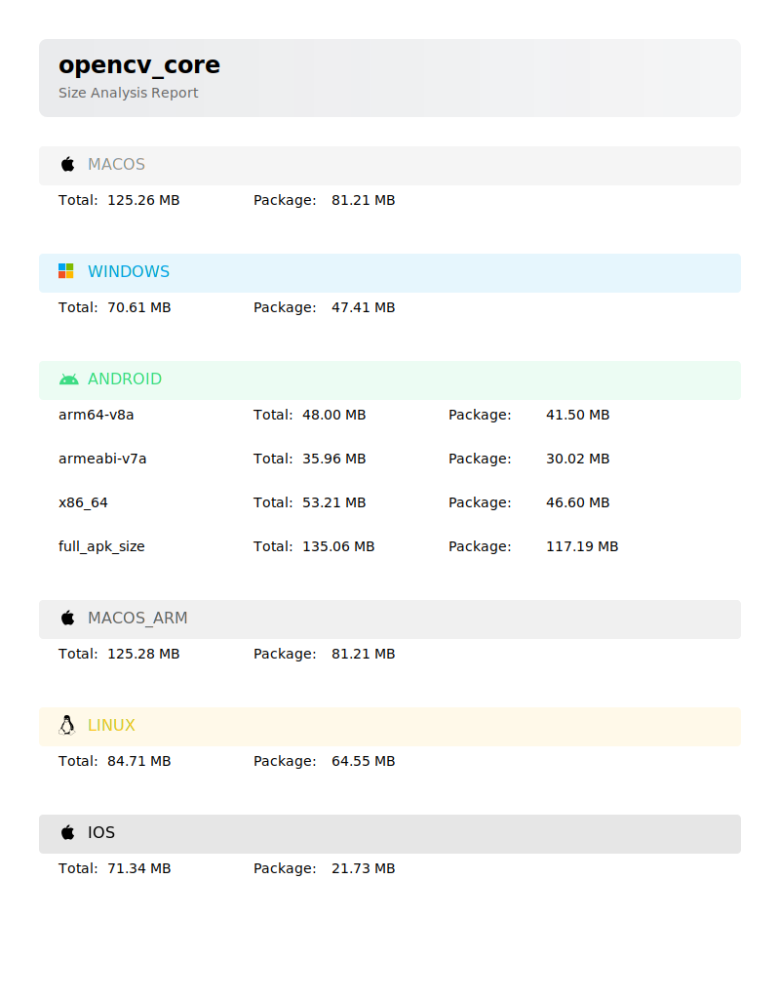

# opencv_core

OpenCV for Flutter, if `highgui` or `videoio` is required, use [opencv_dart](https://pub.dev/packages/opencv_dart)

> [!IMPORTANT]
>
> OpenCV SDK (~100M) will be downloaded via `FetchContent` of cmake, you can
> set `DARTCV_CACHE_DIR` environment variable to cache it and avoid downloading it again.

## Supported platforms

| Platform | Supported          | Tested             | Platforms                      |
| -------- | ------------------ | ------------------ | ------------------------------ |
| Android  | :white_check_mark: | :white_check_mark: | x86_64, arm64-v8a, armeabi-v7a |
| iOS      | :white_check_mark: | :white_check_mark: | arm64, x64(Simulator)          |
| Linux    | :white_check_mark: | :white_check_mark: | x64, arm64                     |
| Windows  | :white_check_mark: | :white_check_mark: | x64, arm64                     |
| macOS    | :white_check_mark: | :white_check_mark: | x64, arm64                     |

## Supported modules

[Supported modules](https://github.com/rainyl/opencv_dart?tab=readme-ov-file#status)

## Package Size

## Examples

see [example](https://github.com/rainyl/opencv_core/tree/main/example)

More examples refet to [awesome-opencv_dart](https://github.com/rainyl/awesome-opencv_dart) and share yours

## Screenshots

see [Demos](https://github.com/rainyl/opencv_dart?tab=readme-ov-file#Demos)

## License

[Apache-2.0 License](LICENSE)
