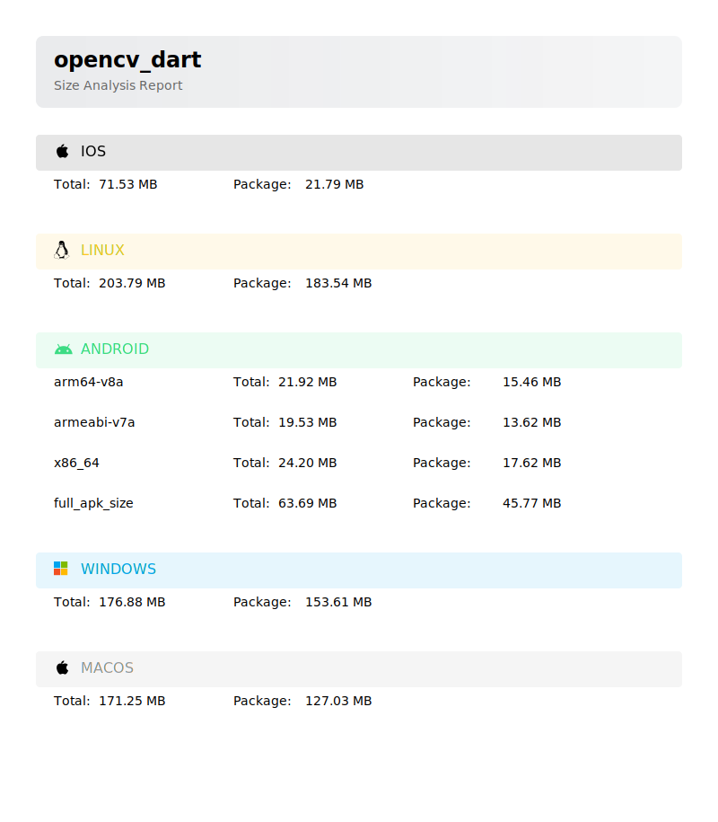

# opencv_dart

OpenCV for Flutter, includes all modules. if `videoio` and `highgui` are not reqired,
use [opencv_core](https://pub.dev/packages/opencv_core)

> [!IMPORTANT]
>
> From `v1.3.0`, dynamic libraries will be built locally, invoked by flutter during the build.
> Note: OpenCV SDK (~100M) will be downloaded via `FetchContent` of cmake, you can
> set `DARTCV_CACHE_DIR` environment variable to cache it and avoid downloading it again.
>
> `v1.0.4 ~ v1.0.6`, libs will be downloaded from
> [Releases](https://github.com/rainyl/opencv_dart/releases) automatically.
>
> 1. If you want to setup manually, please set `OPENCV_DART_DISABLE_AUTO_BUILD` environment variable,
> e.g., `export OPENCV_DART_DISABLE_AUTO_BUILD=1`(for Unix-like)
> or `$env:OPENCV_DART_DISABLE_AUTO_BUILD=1`(for Windows)
>
> For `v1.0.4` and below, make sure run the following setup commands before running your app:
>
> 1. `flutter pub add opencv_dart` or `dart pub add opencv_dart`
> 2. `dart run opencv_dart:setup <platform> --arch <arch>`
>
> | `platform` | `arch`                             |
> | ---------- | ---------------------------------- |
> | `android`  | `x86_64` `arm64-v8a` `armeabi-v7a` |
> | `linux`    | `x64`                              |
> | `windows`  | `x64`                              |
> | `macos`    | `x64` `arm64`                      |
> | `ios`      | `os64` (universal framework)       |
>
> - Q&A: [#212](https://github.com/rainyl/opencv_dart/issues/212) or open new issues.
> - ~~If you are using flutter with [Native Assets](https://github.com/flutter/flutter/issues/129757) feature supported, consider using v2.x version, see more in [native-assets branch](https://github.com/rainyl/opencv_dart/tree/native-assets)~~ Won't update until `Native Assets` being stable.
>

## Supported platforms

| Platform | Supported          | Tested             | Platforms                      |
| -------- | ------------------ | ------------------ | ------------------------------ |
| Android  | :white_check_mark: | :white_check_mark: | x86_64, arm64-v8a, armeabi-v7a |
| iOS      | :white_check_mark: | :white_check_mark: | arm64, x64(Simulator)          |
| Linux    | :white_check_mark: | :white_check_mark: | x64, arm64                     |
| Windows  | :white_check_mark: | :white_check_mark: | x64, arm64                     |
| macOS    | :white_check_mark: | :white_check_mark: | x64, arm64                     |

## Supported modules

[Supported modules](https://github.com/rainyl/opencv_dart?tab=readme-ov-file#status)

## Package Size

## Examples

see [example](https://github.com/rainyl/opencv_dart/tree/main/example)

More examples refet to [awesome-opencv_dart](https://github.com/rainyl/awesome-opencv_dart) and share yours

## Screenshots

see [Demos](https://github.com/rainyl/opencv_dart?tab=readme-ov-file#Demos)

## License

[Apache-2.0 License](LICENSE)
